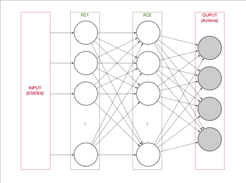
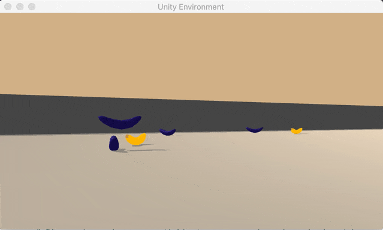
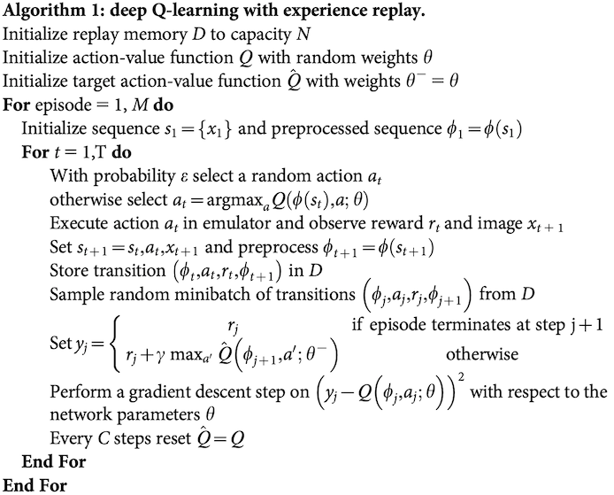
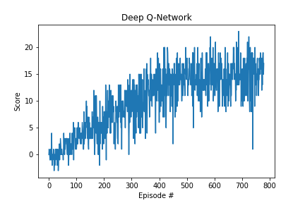
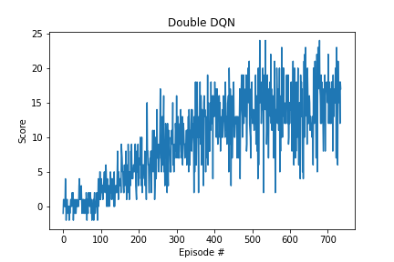

[//]: # (Image References)

## Project 1- Navigation

In this project I have implemented 2 of the Deep Q-Learning Algorithms.

### Learning Algorithms
The two solutions share the same architecture for de Q-Networks, and the same hyperparameters.  

* Hyperparameters  
$\epsilon$ = 1.0; $\epsilon_{min}$ = 0.001; $\epsilon_{decay}$ = 0.995  
$\gamma$ = 0.99  
$\tau$ = $10^{-3}$  
LR = $5*10^{-4}$ = 0.0005
* Network Architecture
Q-Network: 2 Fully Connected Layers with 64 neurons each one.
Input: tensor of State size 
Output: tensor of Action size

We train for 2000 episodes, and we consider solved if we reach the average reward of _+13_ for _100_ episodes. Anyway, we trained the models until they reached an average of _+15_ to get more stability on results at play (in the example we see the agent stuck moving the environment even it was using a trained network)

We save the weights in the file **_model.pth_** (or the one specified in the function parameter)  

#### Deep Q-Learning

We implement the Deep Q-Learning Algorithm like in class and the original [paper](https://storage.googleapis.com/deepmind-media/dqn/DQNNaturePaper.pdf):

* Description of Algorithm  

Where $\theta$ are the weights of the Network

* Plot of Rewards

 

Environment solved in __680__ episodes!	Average Score: 15.01

#### Double Q-Learning

We use the same algorithm as in Deep Q-Learning, but change this line:

$$Y_t^Q \equiv R_{t+1} + \gamma \underset{a}{max} Q(S_{t+1},a; \boldsymbol{\theta}) $$
 for this
* Description of Algorithm
$$Y_t^{DoubleQ} \equiv R_{t+1} + \gamma Q(S_{t+1}, \underset{a}{argmax} Q(S_{t+1},a,\boldsymbol{\theta}) ; \boldsymbol{\theta^-}) $$
* Plot of Rewards  
Environment solved in __635__ episodes!	Average Score: 15.02

 

### Playing agent

Example of the playing agent. 

### Ideas for Future Work

- Change the network model (add dropout, change number of neurons, add layers)
- Play with hyperparameters
- Try other algorithms
    - Dueling DQN
    - Prioritized experience replay
- Solve Learning with pixels